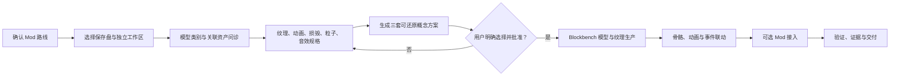

# 方界造模

> **让想象，按确认过的样子进入游戏。**

**方界造模**是一套面向 Minecraft Java 版创作者的 Blockbench 全流程智能资产生产 Skill。它不把“生成一张好看的图”当作完成，而是把需求问诊、三案确认、模型生产、纹理、骨骼动画、损毁、粒子、音效、Mod 联动与验证交付串成同一条可追踪工作流。

## 它为什么强大

| 传统问题 | 方界造模的处理方式 | 最终价值 |
|---|---|---|
| AI 未询问就直接建模 | 路径、范围、需求、概念和生产分别确认 | 用户始终拥有设计决定权 |
| 概念图很好看，Blockbench 无法还原 | 生图提示受方块几何、UV、骨骼和运行边界约束 | 概念与成品差距更小 |
| 模型、动画、粒子和音效各自为战 | 用统一资产身份和动画事件表联动 | 能动、能打、能发光、能发声 |
| 多模型文件容易混乱 | 一个模型一个独立工作区 | 不混放、不覆盖、可追踪 |
| 文件生成成功就宣称完成 | 重新打开、结构校验、运行测试和证据分级 | 交付结果可以验证 |

它真正改变的不是某一个建模按钮，而是建模协作方式：**AI 不替用户做决定，而是把用户确认过的决定，可靠地变成游戏资产。**

> 宣传主视觉将在 `assets/promo/P01-official-hero.png` 上传后加入此处。

## 能制作什么

- 生物、怪物、Boss、NPC、宠物、坐骑与召唤物
- 武器、盔甲、法杖、枪械、盾牌、工具与 RPG 装备
- 方块、机器、炮台、能源设备、自动化与生电设施
- 建筑、家具、交通工具、雕像、遗迹与装饰结构
- 投射物、掉落物、战利品、损毁残骸与关联资产
- 待机、移动、攻击、技能、冷却、归位、死亡与损毁动画
- 粒子挂点、音效事件、动画事件和 Java Mod 运行时接入

## 全流程



关键原则：路径确认、概念选择、正式建模、音效映射与 Mod 接入是不同批准步骤，不能互相代替。

## 快速开始

在 Codex 中输入：

```text
$create-blockbench-minecraft-models

我要制作一个机械风格的水晶防御塔。
先询问需求并生成三套概念方案，不要直接建模。
```

模型优先路线同样可用：

```text
我还没有 Mod，先完成 Blockbench 模型、纹理和动画。
目标是 Minecraft Java 版，运行时接入以后再确定。
```

## 文档导航

| 文档 | 内容 |
|---|---|
| [完整工作流](docs/WORKFLOW.md) | 从启动到验证交付的全部阶段与批准门 |
| [详细使用说明](docs/USER_GUIDE.md) | 新用户操作方法、输入范例和修改反馈格式 |
| [使用环境与注意事项](docs/ENVIRONMENT.md) | Windows、Blockbench、JDK、路径、性能和版权边界 |
| [官方宣发文案](docs/PROMOTION.md) | 官方命名、宣传语、平台简介和核心卖点 |
| [AI 生图提示词](docs/IMAGE_PROMPTS.md) | P00 视觉基准图与 P01–P06 宣传图完整提示词 |
| [图片上传指南](assets/promo/README.md) | 宣传图文件名、尺寸、顺序和 README 接入方式 |
| [发布检查表](docs/PUBLISHING_CHECKLIST.md) | 图片、文字、链接、声明和平台发布前检查 |

## 一个模型，一个独立工作区

```text
D:\Minecraft-Blockbench-Models\energy_defense\crystal_tower__v1
├─ consultation
├─ concepts
├─ specs
├─ source
├─ textures
├─ animations
├─ audio
├─ particles
├─ previews
├─ exports
└─ evidence
```

投射物、召唤物、掉落物或独立损毁残骸如果拥有单独 `.bbmodel`，就必须拥有自己的同级文件夹和资产身份。

## 交付内容

- Blockbench `.bbmodel` 源文件
- 纹理图集与发光遮罩
- 骨骼、动画和状态转换规格
- 粒子、音效及动画事件映射
- 游戏运行时导出文件
- 多模型资产索引
- 校验报告、哈希与运行证据

## 专业边界

- 概念图不是模型完成证据。
- 文件写入成功不代表 Blockbench 可以正确打开。
- Blockbench 动画不等于真实伤害、碰撞或服务端逻辑。
- 粒子和音效通常需要资源包或 Mod 运行时接入。
- 没有真实项目与运行证据时，只能声明兼容方向，不能宣称已验证。

## 项目声明

“方界造模”是本项目的品牌展示名，技术调用名为 `create-blockbench-minecraft-models`。本项目不是 Mojang、Minecraft 或 Blockbench 的官方产品，也不代表与其存在官方合作或背书。

当前仓库用于项目说明、使用文档与公开宣发。除非仓库后续明确加入开源许可证，否则公开可见不等于授予复制、修改或商业再分发权利。
