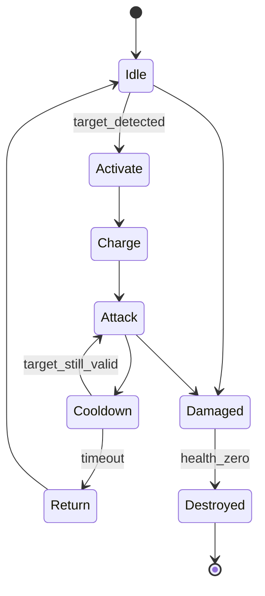

# 方界造模完整工作流

本文定义从第一次对话到最终交付的标准流程。核心目标是减少错误理解、未经确认的生产、跨模型混放和“生成成功即完成”的虚假交付。

## 0. 启动与路线选择

首先确认用户是否已有 Minecraft Java 版 Mod 项目。

- **已有项目：**只读检查 Minecraft、加载器、JDK、Gradle、Mod ID 和资源结构。
- **需要新建：**先展示创建规格、目标目录和版本证据，明确批准后再创建。
- **模型优先：**完整制作 Blockbench 模型、纹理和动画，运行时接入延后。
- **只做模型：**不擅自创建 Mod。

缺少 Mod 不会阻断建模，但会限制运行时验证声明。

## 1. 保存位置与资产身份

1. 询问 Windows 盘符和父目录。
2. 展示完整绝对路径。
3. 等待明确路径批准。
4. 检查目标是否已经存在。
5. 创建专用工作区并记录 `asset_id`。

文件夹创建只代表存储位置已确认，不代表用户批准正式建模。

每个独立 `.bbmodel` 对应一个独立工作区。投射物、召唤物、掉落物和独立残骸模型使用同级文件夹。

## 2. 模型类别与关联资产

先确认主体属于生物、武器、物品、方块、机器、建筑、家具、交通工具还是其他类别，再主动扩展可能需要的关联资产。

示例：

```text
主体：水晶防御塔
关联：能量弹、核心掉落物、损毁残骸
明确排除：展示底座、召唤物
```

任何关联资产都必须先经过范围批准，不能在概念图中偷偷加入。

## 3. 需求规格

需要锁定：

- 世界观、用途、尺寸和游戏视角
- 轮廓、材质、配色与发光区域
- Minecraft 目标版本与模型格式
- 方块化程度、骨骼、旋转原点和碰撞意图
- 纹理尺寸、纹素密度和性能预算
- 待机、移动、攻击、技能、冷却、死亡与损毁需求
- 粒子、音效、投射物和运行时事件

高分辨率纹理必须匹配真实材质细节，不能只把低清纹理放大。

## 4. 动画与损毁系统

动画不是孤立片段，而是状态机：



旋转部件必须锁定父级、原点、旋转轴、方向、半径、朝向、安全距离和插值过程。公转和自转不能混淆。

可破坏资产还需要明确视觉损伤阶段、真实生命值来源、碰撞变化、动画中断、粒子与音效停止规则，以及使用同模型状态还是独立残骸模型。

## 5. 粒子与音效合同

粒子设计至少包含发射位置、骨骼挂点、方向、颜色、数量、速度、生命周期、预算、触发与停止条件。

音频可以使用中文文件名或数字编号。系统先生成映射表：

| 原文件 | 英文事件名 | 目标资产 | 触发动作 |
|---|---|---|---|
| 炮台启动.wav | `tower.activate` | 水晶塔 | 启动 |
| 能量弹发射.wav | `tower.fire` | 水晶塔 | 发射 |
| 命中爆炸.wav | `projectile.impact` | 能量弹 | 命中 |

用户确认映射前，不改名、不转换、不覆盖原文件。模型方案批准和音频映射批准相互独立。

## 6. 生图前确认

展示一张完整需求表，至少包含：

- 主体和关联资产
- 保存路径
- 模型格式与尺寸
- 纹理规格
- 动画与损毁
- 粒子与音效
- Mod 路线
- 明确排除项

只有用户确认这张表，才能生成三套概念图。

## 7. 三套概念方案

每套方案独立生成，展示正面、侧面、背面、俯视和关键状态。概念图只使用 Blockbench 能实现的方块几何、简单旋转、明确材质分区和可执行光效边界。

用户可以选择 A、B、C，或明确组合某些部分。选择偏好不自动等于正式生产批准。

## 8. 正式建模

用户明确说“确认方案，开始正式建模”后，才可以创建：

- `.bbmodel`
- 几何分组和稳定 UUID
- UV 与纹理图集
- 骨骼和旋转原点
- 动画片段与事件
- 发光遮罩、粒子挂点和导出文件

生产阶段不得重新解释或擅自美化已经批准的设计。

## 9. 预览与修订

交付预览至少包括正面、侧面、背面、俯视、待机、攻击、冷却、损毁、纹理图集和动画列表。

穿模检查不能只看关键帧，还要检查插值过程。修改反馈按“对象—位置—问题—目标—约束”记录，避免模型身份漂移。

## 10. Mod 接入

只有得到独立批准并确认真实项目版本后，才接入：

- 实体、方块、物品或投射物注册
- 模型与纹理资源路径
- 动画控制器
- 伤害、冷却、碰撞与目标选择
- 粒子和音效事件
- 客户端与服务端职责
- 死亡与残骸切换

不根据记忆猜测加载器和版本组合。

## 11. 验证与证据

最终验证包括：

- `.bbmodel` 重新打开
- UUID、Outliner、骨骼和纹理引用
- 动画长度、循环、关键帧和原点
- 穿模、碰撞和状态中断
- 音效、粒子与动画事件目标
- 多模型路径、ID 和输出隔离
- Mod 构建与游戏内运行证据

支持声明分为“实验性”“兼容”“已验证”。没有真实运行证据时不能使用“已验证”。

## 批准门总表

以下确认互不替代：

1. 保存路径批准
2. 主体与关联资产范围批准
3. 生图前需求批准
4. 概念方案选择
5. 正式建模批准
6. 音频映射批准
7. Mod 创建或接入批准
8. 最终交付确认
